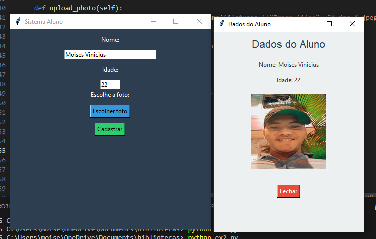

# 📚 Sistema de Cadastro de Alunos

Bem-vindo ao **Sistema de Cadastro de Alunos**! 🎓 Este projeto em Python utiliza a biblioteca Tkinter para criar uma interface gráfica onde os usuários podem registrar informações sobre alunos.

## 🎯 Funcionalidades

- **Cadastro de Alunos**: Insira o nome e a idade do aluno.
- **Carregar Foto**: Selecione uma foto do seu dispositivo para associar ao registro.
- **Exibir Dados**: Visualize as informações cadastradas em uma nova janela, incluindo a foto do aluno.

## 🖼️ Exemplo de Uso

  


## ⚙️ Como Executar

1. Certifique-se de ter o Python instalado em sua máquina.
2. Instale a biblioteca Pillow, se ainda não estiver instalada:
   ```bash
   pip install Pillow
